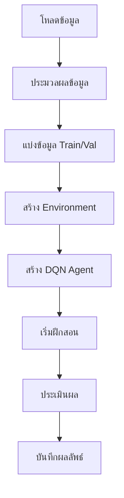

# ระบบการเทรดคริปโตด้วย DQN

## ภาพรวมการทำงาน

ระบบนี้ใช้ Deep Q-Network (DQN) ในการเทรดคริปโต โดยมีโครงสร้างหลักดังนี้:

### 1. โครงสร้างระบบ
- `DQNAgent`: ตัวแทน AI ที่ใช้ Deep Q-Network
- `CryptoTradingEnv`: สภาพแวดล้อมจำลองการเทรด
- `DataProcessor`: จัดการและประมวลผลข้อมูล

### 2. กระบวนการทำงาน


### 3. รายละเอียดการทำงาน

#### ก. การเตรียมข้อมูล
- โหลดข้อมูลราคาจาก CSV หรือ Binance
- เพิ่ม technical indicators
- แบ่งข้อมูลเป็น train (80%) และ validation (20%)

#### ข. การสร้าง Environment
- รับข้อมูลราคาและ indicators
- กำหนด action space: [-1, 1] สำหรับ position และ leverage
- คำนวณ reward จากกำไร/ขาดทุน

#### ค. การสร้าง DQN Agent
- สร้าง neural network 3 layers
- ใช้ experience replay
- มี target network สำหรับความเสถียร

#### ง. กระบวนการฝึกสอน
- วนลูปตามจำนวน episodes
- แต่ละ episode:
  - เลือก action ด้วย epsilon-greedy
  - ดำเนินการใน environment
  - เก็บ experience
  - train network
  - อัพเดท target network

### 4. การประเมินผล
- วัดผลด้วย metrics:
  - กำไรรวม
  - อัตราการชนะ
  - Sharpe ratio
  - Drawdown
  - จำนวนการเทรด

### 5. การบันทึกผล
- บันทึกโมเดลที่ดีที่สุด
- บันทึกกราฟแสดงผลการฝึกสอน
- บันทึกประวัติการฝึกสอน

## วิธีการใช้งาน

### 1. การติดตั้ง
```bash
pip install -r requirements.txt
```

### 2. การเตรียมข้อมูล
```python
from data.data_processor import DataProcessor
from data.data_collector import BinanceDataCollector

# ดึงข้อมูลจาก Binance
collector = BinanceDataCollector(
    symbol='BTCUSDT',
    interval='1h',
    start_date='2023-01-01',
    end_date='2023-12-31'
)
data = collector.get_historical_klines()
```

### 3. การฝึกสอน
```python
from train import train_dqn_agent

results = train_dqn_agent(
    symbol='BTCUSDT',
    timeframe='1h',
    start_date='2023-01-01',
    end_date='2023-12-31',
    initial_balance=10000.0,
    window_size=10,
    batch_size=64,
    episodes=1000
)
```

### 4. พารามิเตอร์ที่สำคัญ
- `symbol`: คู่เหรียญที่ต้องการเทรด
- `timeframe`: กรอบเวลา (1m, 5m, 15m, 1h, 4h, 1d)
- `window_size`: ขนาดหน้าต่างข้อมูลย้อนหลัง
- `batch_size`: ขนาด batch สำหรับการฝึกสอน
- `episodes`: จำนวนรอบการฝึกสอน

### 5. การปรับแต่ง
- ปรับ hyperparameters ใน `DQNAgent`
- ปรับ reward function ใน `CryptoTradingEnv`
- ปรับค่าธรรมเนียมการเทรด
- ปรับขนาด window size

## ข้อควรระวัง
1. ตรวจสอบ GPU ก่อนเริ่มฝึกสอน
2. ใช้ข้อมูลเพียงพอสำหรับการฝึกสอน
3. ตรวจสอบความถูกต้องของข้อมูล
4. ระวังการ overfitting
5. ทดสอบโมเดลกับข้อมูลใหม่เสมอ

## การพัฒนาต่อยอด
1. เพิ่ม indicators ใหม่
2. ปรับปรุง reward function
3. เพิ่มเทคนิคการเทรด
4. ปรับปรุงการจัดการความเสี่ยง
5. เพิ่มการเทรดหลายคู่เหรียญ 

## การแสดงผลภาพ (Visualization)

### 1. กราฟแสดงผลการเทรด
```python
# แสดงผลการเทรดที่ดีที่สุด
def show_best_trading_results(env, run_dir):
    # สร้างโฟลเดอร์สำหรับเก็บผลลัพธ์
    results_dir = os.path.join(run_dir, 'visualization')
    os.makedirs(results_dir, exist_ok=True)
    
    # สร้างและบันทึกกราฟ
    plt.figure(figsize=(15, 10))
    env.render(mode='human')
    plt.savefig(os.path.join(results_dir, 'best_trading_results.png'))
    plt.close()
    
    # บันทึกข้อมูลการเทรด
    trading_data = {
        'trades': env.trades,
        'account_history': env.account_history,
        'metrics': {
            'total_profit': env.balance - env.initial_balance,
            'total_trades': len(env.trades),
            'win_rate': len([t for t in env.trades if t['profit'] > 0]) / len(env.trades) if env.trades else 0
        }
    }
    
    # บันทึกข้อมูลเป็น JSON
    with open(os.path.join(results_dir, 'trading_data.json'), 'w') as f:
        json.dump(trading_data, f, indent=4)
```

### 2. โครงสร้างไฟล์ผลลัพธ์
```
outputs/
├── {symbol}_{timeframe}_{timestamp}/    # โฟลเดอร์สำหรับแต่ละการฝึกสอน
│   ├── visualization/
│   │   ├── best_trading_results.png    # กราฟแสดงผลการเทรด
│   │   ├── trading_data.json          # ข้อมูลการเทรด
│   │   └── training_summary.png       # กราฟสรุปผลการฝึกสอน
│   ├── checkpoints/                    # โฟลเดอร์เก็บ checkpoint
│   │   ├── model_episode_{n}.keras    # โมเดลแต่ละ episode
│   │   ├── history_episode_{n}.json   # ประวัติการฝึกสอน
│   │   └── state_episode_{n}.json     # สถานะการฝึกสอน
│   ├── best_model.h5                  # โมเดลที่ดีที่สุด
│   └── final_model.h5                 # โมเดลสุดท้าย
```

### 3. การกำหนดตำแหน่งไฟล์ผลลัพธ์
```python
# ตัวอย่างการกำหนดตำแหน่งไฟล์ผลลัพธ์
output_dir = 'outputs'  # โฟลเดอร์หลักสำหรับเก็บผลลัพธ์
timestamp = datetime.now().strftime("%Y%m%d_%H%M%S")
run_name = f"{symbol}_{timeframe}_{timestamp}"
run_dir = os.path.join(output_dir, run_name)
```

### 4. กราฟสรุปผลการฝึกสอน
```python
def plot_training_summary(history, run_dir):
    # สร้างกราฟสรุปผล
    fig = plt.figure(figsize=(20, 15))
    
    # กราฟ Training Rewards
    plt.subplot(2, 2, 1)
    plt.plot(history['train_rewards'], label='Training Rewards')
    plt.title('Training Rewards')
    plt.xlabel('Episode')
    plt.ylabel('Reward')
    plt.grid(True)
    
    # กราฟ Training Profits
    plt.subplot(2, 2, 2)
    plt.plot(history['train_profits'], label='Training Profits')
    plt.title('Training Profits')
    plt.xlabel('Episode')
    plt.ylabel('Profit')
    plt.grid(True)
    
    # กราฟ Validation Results
    plt.subplot(2, 2, 3)
    plt.plot(history['val_rewards'], label='Validation Rewards')
    plt.plot(history['val_profits'], label='Validation Profits')
    plt.title('Validation Results')
    plt.xlabel('Episode')
    plt.ylabel('Value')
    plt.legend()
    plt.grid(True)
    
    # กราฟ Exploration Rate
    plt.subplot(2, 2, 4)
    plt.plot(history['exploration_rates'], label='Exploration Rate')
    plt.title('Exploration Rate (Epsilon)')
    plt.xlabel('Episode')
    plt.ylabel('Epsilon')
    plt.grid(True)
    
    plt.tight_layout()
    plt.savefig(os.path.join(run_dir, 'training_summary.png'))
    plt.close()
```

### 5. การปรับแต่งการแสดงผล
```python
# ตัวอย่างการปรับแต่งการแสดงผล
plt.style.use('seaborn')      # ใช้สไตล์ seaborn
plt.rcParams['figure.figsize'] = (15, 10)  # ตั้งค่าขนาดกราฟ
plt.rcParams['font.size'] = 12  # ตั้งค่าขนาดตัวอักษร
```

### 6. ข้อควรระวังในการแสดงผล
1. ตรวจสอบพื้นที่จัดเก็บไฟล์กราฟ
2. ระวังการใช้หน่วยความจำมากเกินไป
3. ปิดกราฟหลังจากบันทึก
4. ตรวจสอบการแสดงผลที่ถูกต้อง
5. บันทึกกราฟในรูปแบบที่เหมาะสม 

## หมายเหตุเกี่ยวกับ Directory
- โฟลเดอร์ `outputs/` เป็นโฟลเดอร์หลักที่ใช้เก็บผลลัพธ์การฝึกสอนทั้งหมด
- โฟลเดอร์ `models/` ไม่ได้ถูกใช้งานในการฝึกสอน (สามารถลบได้)
- โมเดลทั้งหมดจะถูกเก็บในโฟลเดอร์ `outputs/{symbol}_{timeframe}_{timestamp}/`

### 2. โครงสร้างไฟล์ผลลัพธ์
```
outputs/
├── {symbol}_{timeframe}_{timestamp}/    # โฟลเดอร์สำหรับแต่ละการฝึกสอน
│   ├── visualization/
│   │   ├── best_trading_results.png    # กราฟแสดงผลการเทรด
│   │   ├── trading_data.json          # ข้อมูลการเทรด
│   │   └── training_summary.png       # กราฟสรุปผลการฝึกสอน
│   ├── checkpoints/                    # โฟลเดอร์เก็บ checkpoint
│   │   ├── model_episode_{n}.keras    # โมเดลแต่ละ episode
│   │   ├── history_episode_{n}.json   # ประวัติการฝึกสอน
│   │   └── state_episode_{n}.json     # สถานะการฝึกสอน
│   ├── best_model.h5                  # โมเดลที่ดีที่สุด
│   └── final_model.h5                 # โมเดลสุดท้าย
```

### 3. การกำหนดตำแหน่งไฟล์ผลลัพธ์
```python
# ตัวอย่างการกำหนดตำแหน่งไฟล์ผลลัพธ์
output_dir = 'outputs'  # โฟลเดอร์หลักสำหรับเก็บผลลัพธ์
timestamp = datetime.now().strftime("%Y%m%d_%H%M%S")
run_name = f"{symbol}_{timeframe}_{timestamp}"
run_dir = os.path.join(output_dir, run_name)
```

### 4. กราฟสรุปผลการฝึกสอน
```python
def plot_training_summary(history, run_dir):
    # สร้างกราฟสรุปผล
    fig = plt.figure(figsize=(20, 15))
    
    # กราฟ Training Rewards
    plt.subplot(2, 2, 1)
    plt.plot(history['train_rewards'], label='Training Rewards')
    plt.title('Training Rewards')
    plt.xlabel('Episode')
    plt.ylabel('Reward')
    plt.grid(True)
    
    # กราฟ Training Profits
    plt.subplot(2, 2, 2)
    plt.plot(history['train_profits'], label='Training Profits')
    plt.title('Training Profits')
    plt.xlabel('Episode')
    plt.ylabel('Profit')
    plt.grid(True)
    
    # กราฟ Validation Results
    plt.subplot(2, 2, 3)
    plt.plot(history['val_rewards'], label='Validation Rewards')
    plt.plot(history['val_profits'], label='Validation Profits')
    plt.title('Validation Results')
    plt.xlabel('Episode')
    plt.ylabel('Value')
    plt.legend()
    plt.grid(True)
    
    # กราฟ Exploration Rate
    plt.subplot(2, 2, 4)
    plt.plot(history['exploration_rates'], label='Exploration Rate')
    plt.title('Exploration Rate (Epsilon)')
    plt.xlabel('Episode')
    plt.ylabel('Epsilon')
    plt.grid(True)
    
    plt.tight_layout()
    plt.savefig(os.path.join(run_dir, 'training_summary.png'))
    plt.close()
```

### 5. การปรับแต่งการแสดงผล
```python
# ตัวอย่างการปรับแต่งการแสดงผล
plt.style.use('seaborn')      # ใช้สไตล์ seaborn
plt.rcParams['figure.figsize'] = (15, 10)  # ตั้งค่าขนาดกราฟ
plt.rcParams['font.size'] = 12  # ตั้งค่าขนาดตัวอักษร
```

### 6. ข้อควรระวังในการแสดงผล
1. ตรวจสอบพื้นที่จัดเก็บไฟล์กราฟ
2. ระวังการใช้หน่วยความจำมากเกินไป
3. ปิดกราฟหลังจากบันทึก
4. ตรวจสอบการแสดงผลที่ถูกต้อง
5. บันทึกกราฟในรูปแบบที่เหมาะสม 