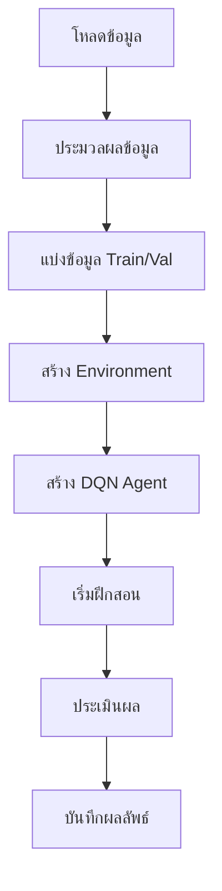

# ระบบการเทรดคริปโตด้วย DQN

## ภาพรวมการทำงาน

ระบบนี้ใช้ Deep Q-Network (DQN) ในการเทรดคริปโต โดยมีโครงสร้างหลักดังนี้:

### 1. โครงสร้างระบบ
- `DQNAgent`: ตัวแทน AI ที่ใช้ Deep Q-Network
- `CryptoTradingEnv`: สภาพแวดล้อมจำลองการเทรด
- `DataProcessor`: จัดการและประมวลผลข้อมูล

### 2. กระบวนการทำงาน


### 3. รายละเอียดการทำงาน

#### ก. การเตรียมข้อมูล
- โหลดข้อมูลราคาจาก CSV หรือ Binance
- เพิ่ม technical indicators
- แบ่งข้อมูลเป็น train (80%) และ validation (20%)

#### ข. การสร้าง Environment
- รับข้อมูลราคาและ indicators
- กำหนด action space: [-1, 1] สำหรับ position และ leverage
- คำนวณ reward จากกำไร/ขาดทุน

#### ค. การสร้าง DQN Agent
- สร้าง neural network 3 layers
- ใช้ experience replay
- มี target network สำหรับความเสถียร

#### ง. กระบวนการฝึกสอน
- วนลูปตามจำนวน episodes
- แต่ละ episode:
  - เลือก action ด้วย epsilon-greedy
  - ดำเนินการใน environment
  - เก็บ experience
  - train network
  - อัพเดท target network

### 4. การประเมินผล
- วัดผลด้วย metrics:
  - กำไรรวม
  - อัตราการชนะ
  - Sharpe ratio
  - Drawdown
  - จำนวนการเทรด

### 5. การบันทึกผล
- บันทึกโมเดลที่ดีที่สุด
- บันทึกกราฟแสดงผลการฝึกสอน
- บันทึกประวัติการฝึกสอน

## วิธีการใช้งาน

### 1. การติดตั้ง
```bash
pip install -r requirements.txt
```

### 2. การเตรียมข้อมูล
```python
from data.data_processor import DataProcessor
from data.data_collector import BinanceDataCollector

# ดึงข้อมูลจาก Binance
collector = BinanceDataCollector(
    symbol='BTCUSDT',
    interval='1h',
    start_date='2023-01-01',
    end_date='2023-12-31'
)
data = collector.get_historical_klines()
```

### 3. การฝึกสอน
```python
from train import train_dqn_agent

results = train_dqn_agent(
    symbol='BTCUSDT',
    timeframe='1h',
    start_date='2023-01-01',
    end_date='2023-12-31',
    initial_balance=10000.0,
    window_size=10,
    batch_size=64,
    episodes=1000
)
```

### 4. พารามิเตอร์ที่สำคัญ
- `symbol`: คู่เหรียญที่ต้องการเทรด
- `timeframe`: กรอบเวลา (1m, 5m, 15m, 1h, 4h, 1d)
- `window_size`: ขนาดหน้าต่างข้อมูลย้อนหลัง
- `batch_size`: ขนาด batch สำหรับการฝึกสอน
- `episodes`: จำนวนรอบการฝึกสอน

### 5. การปรับแต่ง
- ปรับ hyperparameters ใน `DQNAgent`
- ปรับ reward function ใน `CryptoTradingEnv`
- ปรับค่าธรรมเนียมการเทรด
- ปรับขนาด window size

## ข้อควรระวัง
1. ตรวจสอบ GPU ก่อนเริ่มฝึกสอน
2. ใช้ข้อมูลเพียงพอสำหรับการฝึกสอน
3. ตรวจสอบความถูกต้องของข้อมูล
4. ระวังการ overfitting
5. ทดสอบโมเดลกับข้อมูลใหม่เสมอ

## การพัฒนาต่อยอด
1. เพิ่ม indicators ใหม่
2. ปรับปรุง reward function
3. เพิ่มเทคนิคการเทรด
4. ปรับปรุงการจัดการความเสี่ยง
5. เพิ่มการเทรดหลายคู่เหรียญ 